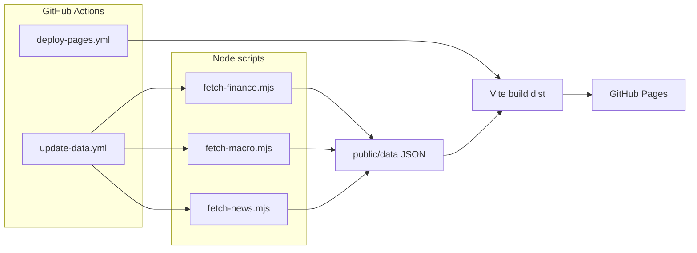

# Personal intelligence dashboard

Static React dashboard (Vite + TypeScript + Tailwind + Recharts) designed for **GitHub Pages**. The UI reads **versioned JSON** from `public/data/`, refreshed on a schedule by **Node fetch scripts** and **GitHub Actions**.

## Architecture

| Layer | Role |
|--------|------|
| **Presentation** (`src/`) | React sections compose reusable widgets; data arrives via `fetch` at runtime. |
| **Contracts** (`src/types/dashboard.ts`) | TypeScript shapes mirror JSON files so UI and scripts stay aligned. |
| **Artifacts** (`public/data/*.json`) | Deployed as static assets; single source of truth for the hosted site. |
| **Pipelines** (`scripts/*.mjs`) | Pull from HTTP APIs / RSS / Reddit, normalize, merge with previous JSON, write back. |
| **Automation** (`.github/workflows/`) | Cron + manual runs update JSON; Pages workflow builds with the correct `base` URL. |



## Folder layout

```
├── .github/workflows/     # Scheduled data refresh + Pages deploy
├── public/
│   ├── data/              # Committed JSON consumed by the app
│   └── favicon.svg
├── scripts/
│   ├── config/
│   │   └── finance-watchlist.json   # ASX tickers for fetch-finance.mjs
│   ├── lib/               # Shared path + JSON helpers
│   ├── fetch-all.mjs      # Orchestrator
│   ├── fetch-finance.mjs  # Share price pipeline → finance.json (Yahoo chart API)
│   ├── fetch-macro.mjs    # FX (Frankfurter) + commodities (Yahoo)
│   └── fetch-news.mjs     # Reddit JSON + RSS (BBC demo)
├── src/
│   ├── components/
│   │   ├── layout/        # App shell, navigation anchors
│   │   └── widgets/     # Reusable cards, charts, lists
│   ├── lib/               # dataUrl helper + useJsonData hook
│   ├── pages/             # Route-level screens (finance, macro, …)
│   ├── types/             # JSON / domain types
│   ├── App.tsx
│   └── main.tsx
├── index.html
├── package.json
├── tailwind.config.js
├── vite.config.ts
└── README.md
```

## Routing

The UI uses **React Router** with a basename derived from Vite’s `import.meta.env.BASE_URL`, so deep links work under GitHub Project Pages (`/Personal-Dashboard/…`). The build copies `index.html` to **`404.html`** so a hard refresh on a client route still loads the SPA.

## Local development

```bash
npm install
npm run dev
```

Production build:

```bash
npm run build
npm run preview
```

## Data pipelines (local)

```bash
npm run data:fetch        # all scripts
npm run data:finance      # finance only
npm run data:macro        # macro only
npm run data:seed         # fill illustrative 90d / 5y series in public/data (optional)
```

- **Share prices (`fetch-finance.mjs`)**: reads **`scripts/config/finance-watchlist.json`** (Yahoo symbols, e.g. `NAB.AX`). For each line it pulls **3mo / 1d** and **5y / 1wk** from Yahoo’s **chart v8** endpoint (unofficial), with **retries**, **spacing between calls**, and **independent 90d vs 5y** error handling so one leg failing does not wipe the other. It writes **`quotes`**, **`history` / `history90d` / `history5y`**, and a **`sharePricePipeline`** audit block (per-symbol OK flags + error strings) used on the Finance page. On failure it **falls back to the previous committed JSON** for that symbol. Optional **`PROPERTY_VALUE_AUD`** overrides the house estimate.
- **Macro**: Frankfurter for **AUD/USD** and history; Yahoo for **gold** (`GC=F`), **Brent** (`BZ=F`), and **WTI** (`CL=F`) as a liquid companion crude leg (swap symbols if your desk prefers true Brent deferred contracts).
- **News**: Reddit hot listings + BBC World RSS (naive XML parse; swap for a proper parser if feeds vary).

Geopolitics and AFL samples are **mock JSON** only; add `scripts/fetch-*.mjs` and append them to `fetch-all.mjs` when you have endpoints.

## GitHub Actions

| Workflow | Purpose |
|-----------|---------|
| `update-data.yml` | `workflow_dispatch` + daily cron: `npm ci`, `npm run data:fetch`, commits `public/data` if changed. |
| `deploy-pages.yml` | On push to `main`: `npm ci`, `npm run build` with `VITE_BASE=/<repo>/`, uploads `dist` to **GitHub Pages**. |

**Repository variables**: optional `PROPERTY_VALUE_AUD` for the data job (see workflow `env`).

**Pages setup**

1. Repo **Settings → Pages**: **Build and deployment** source = **GitHub Actions** (not “Deploy from a branch”).
2. First run of `deploy-pages.yml` may prompt creation of the `github-pages` environment; approve if asked.
3. Default `VITE_BASE` in CI is `/${{ github.event.repository.name }}/`, which matches **Project Pages** at `https://<user>.github.io/<repo>/`.

**User site** (`https://<user>.github.io/` with repo named `<user>.github.io`): set `VITE_BASE=/` in the deploy workflow (or remove the env line and keep `vite.config` default `/`).

## Deployment checklist (GitHub Pages)

1. Push this repo to GitHub on branch `main`.
2. Enable **Pages from Actions** (Settings → Pages).
3. Confirm `deploy-pages.yml` ran successfully; open the **page_url** from the job summary.
4. If assets 404, verify `VITE_BASE` matches the site path (trailing slash is intentional in the workflow).

## Widget system

- **`WidgetCard`**: title, subtitle, optional badge, body, optional footer — terminal-style panel chrome.
- **`WidgetLoading` / `WidgetError`**: consistent empty states for `useJsonData`.
- **`StatGrid`**: compact KPI tiles.
- **`LineTrendChart`**: Recharts line chart with dark tooltip styling.
- **`NewsFeedList`**: scrollable list with topic chips.

Add a new visual primitive under `src/components/widgets/` and re-export from `widgets/index.ts` when it should be shared.

## Adding a future module (checklist)

1. **Types**: extend `src/types/dashboard.ts` (or add `src/types/<topic>.ts` and import where needed).
2. **Data**: add `public/data/<topic>.json` with realistic sample content.
3. **Fetcher** (optional): create `scripts/fetch-<topic>.mjs` writing to `public/data/<topic>.json`; register in `scripts/fetch-all.mjs`.
4. **Loader**: use `useJsonData<T>('<topic>.json')` in a section (already resolves `import.meta.env.BASE_URL` for Pages).
5. **UI**: add `src/pages/<Topic>Page.tsx` composing `MetricTrendRow` / widgets; register a `<Route>` in `App.tsx` and a `NavLink` in `AppShell.tsx`.
6. **Nav**: add an anchor link in `AppShell.tsx` to match the section `id`.

Keep **one JSON file per domain** until size forces splitting; merging related feeds in one script reduces CI noise.

## Aesthetic

Dark “terminal” palette (`tailwind.config.js` `terminal.*` colors), monospace micro-labels, subtle borders and shadows, accent teal (`#00d4aa`) and amber highlights — tuned for a **Bloomberg-adjacent** desk feel without custom asset pipelines.

## License

Private / personal use — configure your own API keys, rate limits, and attribution for third-party data.
